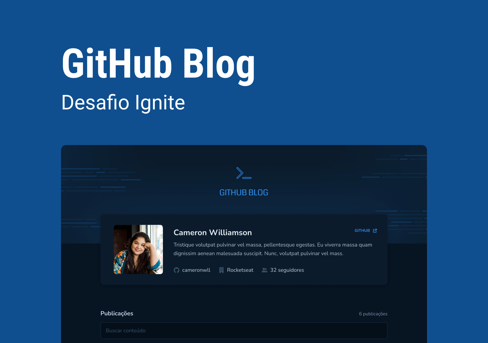

Aplicação desenvolvida como desafio da trilha Ignite da [RockeatSeat](https://rocketseat.com.br/?utm_source=aluno&utm_medium=germano-ricardi&utm_campaign=dev_fullstack).

Veja a aplicação em produção:
[https://germano-ricardi-github-blog.vercel.app/](https://germano-ricardi-github-blog.vercel.app/)

## Descrição  

A aplicação utiliza a API do GitHub para buscar issues de um repositório, dados do perfil e exibir elas como um blog, recursos disponíveis:
*   Listagem do seu perfil com imagem, número de seguidores, nome e outras informações disponíveis pela API do GitHub.
*   Listar e filtrar todas as issues do repositório com um pequeno resumo do conteúdo dela
*   Criar uma página para exibir um post (issue) completo

Apesar de serem poucas as funcionalidades, foram aplicados conceitos como:
*   Fetch / Axios
*   Roteamento e React Router DOM
*   Formulários

## Tecnologias utilizadas

* [x] [NodeJS](https://nodejs.org/en/)
* [x] [React](https://reactjs.org/)
* [x] [Vite](https://vitejs.dev/)
* [x] [TypeScript](https://www.typescriptlang.org/)

## Quickstart
Clone o repositório:
```sh
$  git clone https://github.com/germanoricardi/desafios-rocketseat-github-blog.git
```
Para executar a aplicação Vite:
```sh
$  npm install
$  npm run dev
```